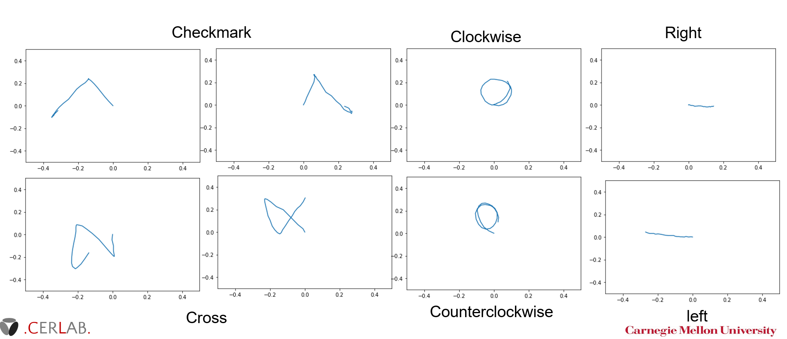
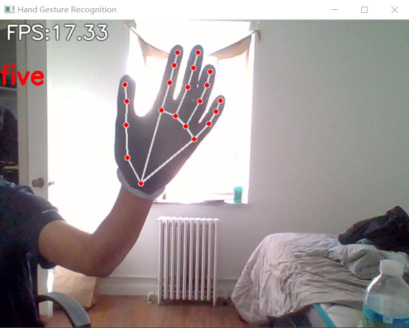
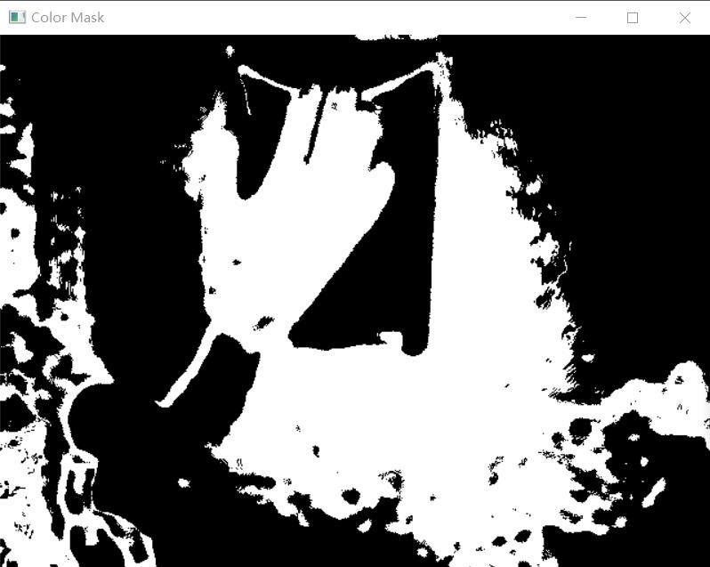

# CerLab_RealTime_HandGesture_Recognition
<div id="top"></div>
<!--
*** Thanks for checking out the Best-README-Template. If you have a suggestion
*** that would make this better, please fork the repo and create a pull request
*** or simply open an issue with the tag "enhancement".
*** Don't forget to give the project a star!
*** Thanks again! Now go create something AMAZING! :D
-->


<!-- PROJECT SHIELDS -->
<!--
*** I'm using markdown "reference style" links for readability.
*** Reference links are enclosed in brackets [ ] instead of parentheses ( ).
*** See the bottom of this document for the declaration of the reference variables
*** for contributors-url, forks-url, etc. This is an optional, concise syntax you may use.
*** https://www.markdownguide.org/basic-syntax/#reference-style-links
-->
<!-- [![Contributors][contributors-shield]][contributors-url]
[![Forks][forks-shield]][forks-url]
[![Stargazers][stars-shield]][stars-url]
[![Issues][issues-shield]][issues-url]
[![MIT License][license-shield]][license-url]
[![LinkedIn][linkedin-shield]][linkedin-url] -->


<!-- PROJECT LOGO -->
<br />
<div align="center">
  <a href="https://github.com/Flora9978/CerLab_RealTime_HandGesture_Recognition">
    
  </a>

<h3 align="center">First View RealTime HandGesture Recognition</h3>

  <p align="center">
    <a href="https://drive.google.com/file/d/10HER3nJzC9eRZMU7xMl89tGWWynFoSwv/view?usp=sharing">View Demo</a>
    ·
    <a href="https://github.com/Flora9978/CerLab_RealTime_HandGesture_Recognition/issues">Report Bug</a>
    ·
    <a href="https://github.com/Flora9978/CerLab_RealTime_HandGesture_Recognition/issues">Request Feature</a>
  </p>
</div>


<!-- TABLE OF CONTENTS -->
<!-- <details>
  <summary>Table of Contents</summary>
  <ol>
    <li>
      <a href="#about-the-project">About The Project</a>
      <ul>
        <li><a href="#built-with">Built With</a></li>
      </ul>
    </li>
    <li>
      <a href="#getting-started">Getting Started</a>
      <ul>
        <li><a href="#prerequisites">Prerequisites</a></li>
        <li><a href="#installation">Installation</a></li>
      </ul>
    </li>
    <li><a href="#usage">Usage</a></li>
    <li><a href="#roadmap">Roadmap</a></li>
    <li><a href="#contributing">Contributing</a></li>
    <li><a href="#license">License</a></li>
    <li><a href="#contact">Contact</a></li>
    <li><a href="#acknowledgments">Acknowledgments</a></li>
  </ol>
</details> -->


<!-- ABOUT THE PROJECT -->
## About The Project

This is a project of real-time first-view hand gesture recognition. Both the static gestures (i.e. thumb up) and dynamic hand gestures (i.e. checkmark, clockwise) can be recognized. 

There are seven dynamic gestures. Dynamic gestures are defined as a gesture that requires multiple video frames to be classified: 

* clockwise
* counterclockwise
* checkmark
* cross
* right
* left
* none (other than the above six)

We show an example of the trajactories of the six dynamic gestures.


You can customize your own gestures.

There are multiple static poses to be recognized. Static poses are different from dynamic gestures, because the classification task is conducted using one image. 
* Number counting (1 - 9)
* Thumb up & thumb down
* Yeah
* Gun
* Point
* ...
<!-- GETTING STARTED -->
## Getting Started

This is an introduction of how you may give instructions on setting up your project locally.
To get a local copy up and running follow these simple example steps.

### Prerequisites

Python 3 is needed. You are welcomed to install the latest python version.

You need to install the following python libraries. 

```sh
pip install tensorflow numpy mediapipe scikit-learn opencv-python pandas seaborn
mediapipe == 0.8.11
opencv-python == 4.6.0.66
```

### Optional

We recommend you to install cuda to accelerate the training process. The version of the cuda and cudnn module should matches the tensorflow version you installed. 


<!-- USAGE EXAMPLES -->
## Usage

Using your camera
```
python3 app.py
```

Using a recorded video
```
python3 app.py --video <path-to-video>
```

Using the glove preprocessor
```
python3 app.py --glove --lowA <glove's low bound of A in LAB space> --lowB <glove's low bound of B in LAB space> --highA <glove's high bound of A in LAB space> --highB <glove's hign bound of B in LAB space>
```

When use the glove preprocessor, you can turn on the show_color_mask mode to show current color mask.
```
python3 app.py --glove --show_color_mask --lowA <glove's low bound of A in LAB space> --lowB <glove's low bound of B in LAB space> --highA <glove's high bound of A in LAB space> --highB <glove's hign bound of B in LAB space>
```


## Directory
```
.
├── README.md
├── app.py
├── conquer_cross_model.ipynb
├── images
│   └── ...
├── keypoint_classification_EN.ipynb
├── glove_utils
│   ├── __init__.py
│   ├── MediapipeDetector.py
│   ├── OpenCVGloveSolver.py
│   ├── OpenCVMaskGenerator.py
├── model
│   ├── __init__.py
│   ├── keypoint_classifier
│   │   ├── keypoint.csv
│   │   ├── keypoint_classifier.hdf5
│   │   ├── keypoint_classifier.py
│   │   ├── keypoint_classifier.tflite
│   │   └── keypoint_classifier_label.csv
│   ├── point_history_classifier
│   │   ├── datasets
│   │   │   ├── point_history.csv
│   │   │   ├── point_history_classifier_label.csv
│   │   │   ├── point_history_xinyang.csv
│   │   │   └── prediction_results.pkl
│   │   ├── point_history_classifier.py
│   │   ├── point_history_classifier_LSTM_ConquerCross.tflite
│   │   ├── point_history_classifier_LSTM_LR_random_10.tflite
│   │   ├── point_history_classifier_LSTM_LR_random_18.tflite
│   │   └── point_history_classifier_LSTM_LR_random_22.tflite
│   └── test.txt
├── utils
│   ├── __init__.py
│   ├── cleaningDataset.py
│   ├── cvfpscalc.py
│   ├── dataManipulation.py
│   ├── delete_polluted_data.py
│   └── hand_gesture_mediapipe.py
└── videos
    └── ...
```

## Description
### app.py
This is a sample program for inference.<br>
In addition, learning data (key points) for hand sign recognition,<br>
You can also collect training data (index finger coordinate history) for finger gesture recognition.

### keypoint_classification.ipynb
This is a model training script for hand pose recognition.

### conquer_cross_model.ipynb
This is a model training script for hand gesture recognition.

### glove_utils/
This directory stores files related to glove preprocessor and Mediapipe detector.<br>
The following files are stored.
* MediaPipe hand detector(MediapipeDetector.py)
* Mask generator based on glove's color(OpenCVMaskGenerator.py)
* Glove preprocessor which help MediaPipe detect a hand with glove (OpenCVGloveSolver.py)

### model/keypoint_classifier
This directory stores files related to hand sign recognition.<br>
The following files are stored.
* Training data(keypoint.csv)
* Trained model(point_history_classifier_LSTM_LR_random_N.tflite): where N is a parameter can be set during the test to pad multiple gestures with maximum length N.
* Label data(keypoint_classifier_label.csv)
* Inference module(keypoint_classifier.py)

### model/point_history_classifier
This directory stores files related to hand gesture recognition.<br>
The following files are stored.
* Training data(./datasets/point_history.csv)
* Trained model(point_history_classifier.tflite)
* Label data(point_history_classifier_label.csv)
* Inference module(point_history_classifier.py)

### images
This directory stores all the images in this project.

### videos
This directory stores all the videos in this project.

### utils/
This directory contains multiple functions to clean the dataset, augment dataset, and evaluate the system.
* First step of deleting polluted data (delete_polluted_data.py): screen the polluted data in the raw dataset into a txt file
* Dataset cleaning (cleaningDataset.py): delete all the screened out data
* Add augmented data points by rotating/translating/scaling the original dataset (utils/dataManipulation.py)
* Mode changing detection (hand_gesture_mediapipe.py): detect the transition between static hand pose mode and dynamic hand gesture mode.
* Add none-sense data points (utils/dataManipulation.py)
* Randomly insert and/or append another data point before/after the current data point. (utils/dataManipulation.py)
* Module for FPS measurement (cvfpscalc.py).


## Demo


<!-- CONTACT -->
## Contact

Yipeng Lin - yipengli@andrew.cmu.edu
Xinyang Chen - xinyangc@andrew.cmu.edu

<p align="right">(<a href="#top">back to top</a>)</p>


<!-- ACKNOWLEDGMENTS -->
## Acknowledgments

* [hand-gesture-recognition-mediapipe(kinivi)](https://github.com/kinivi/hand-gesture-recognition-mediapipe)

<p align="right">(<a href="#top">back to top</a>)</p>


<!-- MARKDOWN LINKS & IMAGES -->
<!-- https://www.markdownguide.org/basic-syntax/#reference-style-links -->
[contributors-shield]: https://img.shields.io/github/contributors/github_username/repo_name.svg?style=for-the-badge
[contributors-url]: https://github.com/Flora9978/CerLab_RealTime_HandGesture_Recognition/graphs/contributors
[forks-shield]: https://img.shields.io/github/forks/github_username/repo_name.svg?style=for-the-badge
[forks-url]: https://github.com/Flora9978/CerLab_RealTime_HandGesture_Recognition/network/members
[stars-shield]: https://img.shields.io/github/stars/github_username/repo_name.svg?style=for-the-badge
[stars-url]: https://github.com/Flora9978/CerLab_RealTime_HandGesture_Recognition/stargazers
[issues-shield]: https://img.shields.io/github/issues/github_username/repo_name.svg?style=for-the-badge
[issues-url]: https://github.com/Flora9978/CerLab_RealTime_HandGesture_Recognition/issues
[license-shield]: https://img.shields.io/github/license/github_username/repo_name.svg?style=for-the-badge
[license-url]: https://github.com/Flora9978/CerLab_RealTime_HandGesture_Recognition/blob/master/LICENSE.txt
[linkedin-shield]: https://img.shields.io/badge/-LinkedIn-black.svg?style=for-the-badge&logo=linkedin&colorB=555
[linkedin-url]: https://www.linkedin.com/in/yipeng-lin/
<!-- [product-screenshot]: images/short_demo.gif -->
